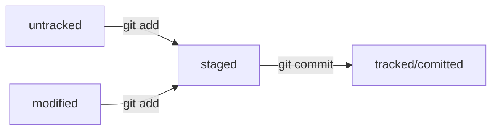

## git log
```
git log
```
Команда git log позволяет просмотреть историю коммитов в репозитории.

По умолчанию (без аргументов) git log перечисляет коммиты, сделанные в репозитории, в обратном к хронологическому порядку — последние коммиты находятся вверху.

Команда git log имеет большое количество опций для поиска коммитов по разным критериям. Вот некоторые из них:

-p или --patch — показывает разницу (выводит патч), внесённую в каждый коммит;

--stat — показывает статистику изменённых файлов для каждого коммита;

--shortstat — отображает только строку с количеством изменений/вставок/удалений для команды --stat;

--name-only — показывает список изменённых файлов после информации о коммите;

--name-status — показывает список файлов, которые добавлены/изменены/удалены.




## commit

для изменения HEAD комита не создовая новый, существует флаг --amend
```
git commit --amend --no-edit
```

## helpfull 
команда для токо что бы обновить код на локальном репозитории 

'''
git pull && git checkout feature/feodors-new-project && git merge main
'''

- подтянули изменения
- перешли на нашу ветку
- влили последние изменения в нашу ветку


