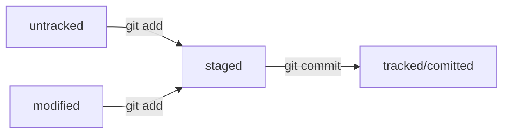

# Шпоргалка по git

## Синхронизация локального и удалённого репозиториев

`git remote add origin https://github.com/YandexPracticum/first-project.git` (от англ. _remote_, «удалённый» + _add,_ «добавить») — привяжи локальный репозиторий к удалённому с URL `https://github.com/YandexPracticum/first-project.git`;

`git remote -v` (от англ. _**v**erbose_, «подробный») — проверь, что репозитории действительно связались;

`git push -u origin main` (от англ. _push_, «толкать») — в первый раз загрузи все коммиты из локального репозитория в удалённый с названием `origin`.

💡 Ваша ветка может называться `master`, а не `main`. Подправьте команду, если это необходимо.

`git push` (от англ. _push_, «толкать») — загрузи коммиты в удалённый репозиторий после того, как он был привязан с помощью флага `-u`.


## git log

```
git log
```
Команда git log позволяет просмотреть историю коммитов в репозитории.

По умолчанию (без аргументов) git log перечисляет коммиты, сделанные в репозитории, в обратном к хронологическому порядку — последние коммиты находятся вверху.

Команда git log имеет большое количество опций для поиска коммитов по разным критериям. Вот некоторые из них:

-p или --patch — показывает разницу (выводит патч), внесённую в каждый коммит;

--stat — показывает статистику изменённых файлов для каждого коммита;

--shortstat — отображает только строку с количеством изменений/вставок/удалений для команды --stat;

--name-only — показывает список изменённых файлов после информации о коммите;

--name-status — показывает список файлов, которые добавлены/изменены/удалены.



## commit

для изменения HEAD комита не создовая новый, существует флаг --amend
```
git commit --amend --no-edit
```

## «Откат» файлов и коммитов

`git restore --staged hello.txt` (от англ. _restore_, «восстановить») — переведи файл `hello.txt` из состояния `staged` обратно в `untracked` или `modified`;

`git restore hello.txt` — верни файл `hello.txt` к последней версии, которая была сохранена через `git commit` или `git add`;

`git reset --hard b576d89` (от англ. _reset_, «сброс», «обнуление» + _hard_, «суровый») — удали все незакоммиченные изменения из staging и «рабочей зоны» вплоть до указанного коммита.

## Просмотр изменений

`git diff` (от англ. _**diff**erence_, «отличие», «разница») — покажи изменения в «рабочей зоне», то есть в `modified`\-файлах;

`git diff a9928ab 11bada1` — выведи разницу между двумя коммитами;

`git diff --staged` — покажи изменения, которые добавлены в

## Подтянуть изменения в ветку разработки
команда для токо что бы обновить код на локальном репозитории 

```
git pull && git checkout feature/feodors-new-project && git merge main
```

- подтянули изменения
- перешли на нашу ветку
- влили последние изменения в нашу ветку


## Клонирование чужого репозитория

`git clone git@github.com:YandexPraktikum/first-project.git` (от англ. _clone_, «клон», «копия») — склонируй репозиторий с URL `first-project.git` из аккаунта `YandexPraktikum` на мой локальный компьютер.

## Создание веток

`git branch feature/the-finest-branch` (от англ. _branch_, «ветка») — создай ветку от текущей с названием `feature/the-finest-branch`;

`git checkout -b feature/the-finest-branch` — создай ветку `feature/the-finest-branch` и сразу переключись на неё.

## Навигация по веткам

`git branch` (от англ. _branch_, «ветка») — покажи, какие есть ветки в репозитории и в какой из них я нахожусь (текущая ветка будет отмечена символом `*`);

`git branch -a` — покажи все известные ветки, как локальные (в локальном репозитории), так и удалённые (в `origin`, или на GitHub).

`git checkout feature/br` — переключись на ветку `feature/br`.

## Сравнение веток

`git diff main HEAD` (от англ. _**diff**erence_, «отличие», «разница») — покажи разницу между веткой `main` и указателем на `HEAD`;

`git diff HEAD~2 HEAD` — покажи разницу между тем коммитом, который был два коммита назад, и текущим.

## Удаление веток

`git branch -d br-name` — удали ветку `br-name`, но только если она является частью `main`;

`git branch -D br-name` — удали ветку `br-name`, даже если она не объединена с `main`.

## Слияние веток

`git merge main` (от англ. _merge_, «сливать», «поглощать») — объедини ветку `main` с текущей активной веткой.

## Работа с удалённым репозиторием

`git push -u origin my-branch` (от англ. _push_, «толкнуть», «протолкнуть») — отправь новую ветку `my-branch` в удалённый репозиторий и свяжи локальную ветку с удалённой, чтобы при дополнительных коммитах можно было писать просто `git push` без `-u`;

`git push my-branch` — отправь дополнительные изменения в ветку `my-branch`, которая уже существует в удалённом репозитории;

`git pull` (от англ. _pull_, «вытянуть») — подтяни изменения текущей ветки из удалённого репозитория.